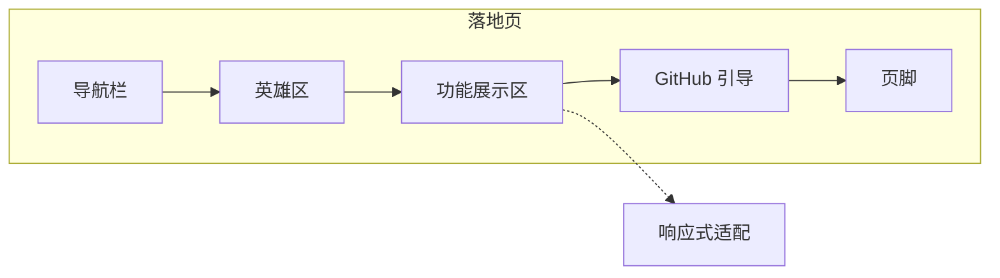
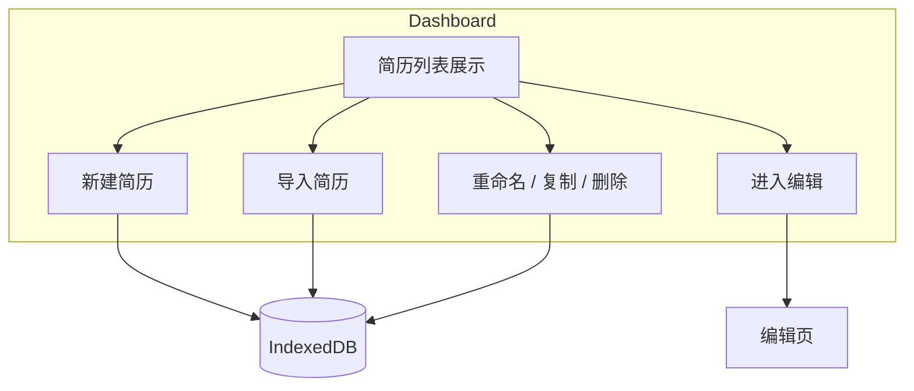
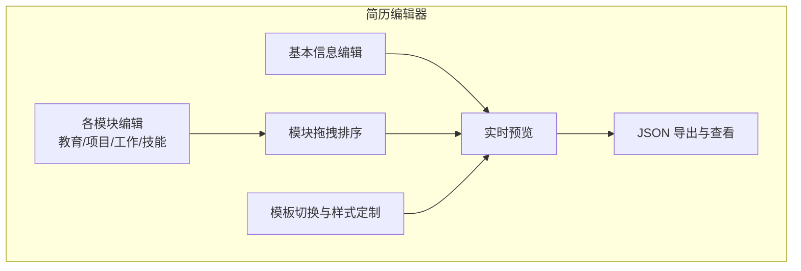
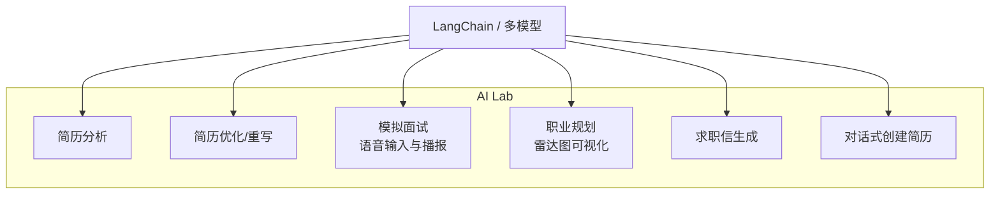
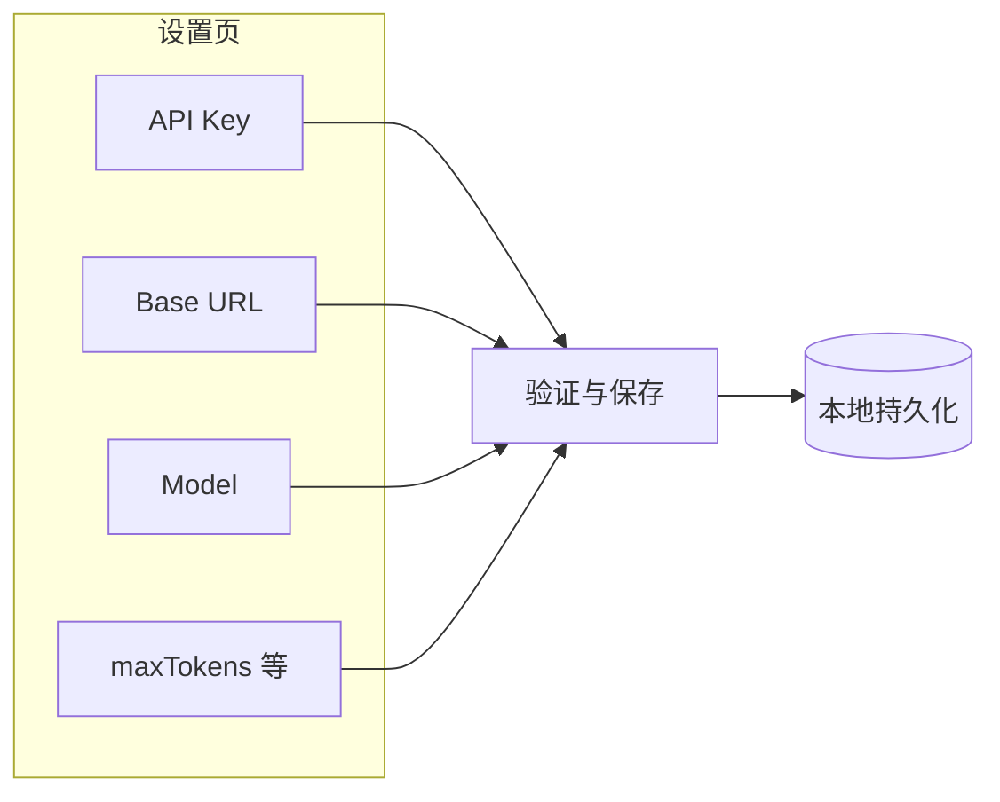
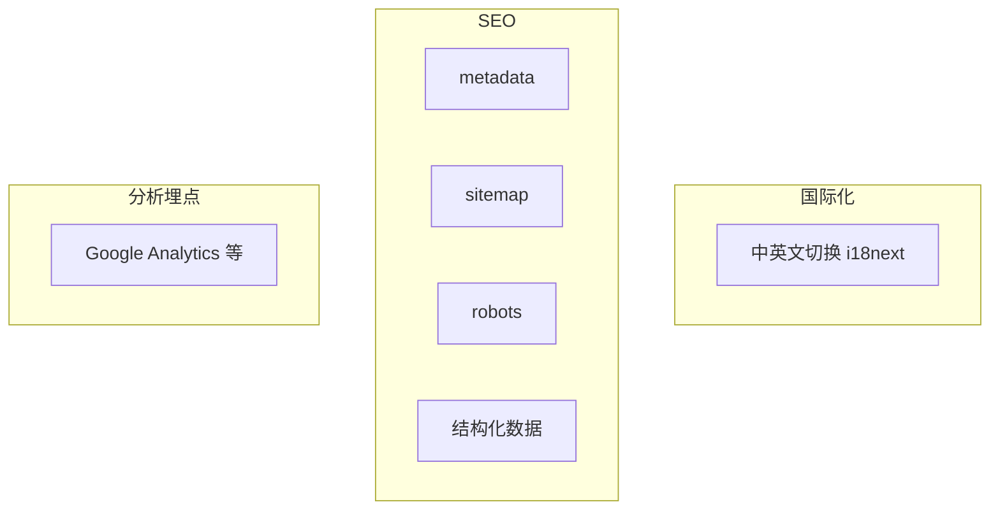

# 图 2.2 - 六大模块功能示意图

> 用于论文 **第 2 章 2.2 功能需求** 各小节。将下方每段 Mermaid 代码复制到 [mermaid.live](https://mermaid.live) 可导出 PNG/SVG 插入论文。

---

## 图 2.2-1 Landing 落地页模块

**对应小节**：2.2.1 Landing 落地页模块

**图注建议**：落地页模块结构：导航栏、英雄区、功能展示区、GitHub 引导与页脚，支持响应式适配。

---

## 图 2.2-2 Dashboard 简历管理模块

**对应小节**：2.2.2 Dashboard 简历管理模块

**图注建议**：简历管理模块功能：简历列表展示，支持新建、导入、重命名、复制、删除及进入编辑。

---

## 图 2.2-3 简历编辑器模块（核心）

**对应小节**：2.2.3 简历编辑器模块（核心）

**图注建议**：简历编辑器核心能力：基本信息与各模块编辑、拖拽排序、实时预览与模板切换、JSON 导出与查看。

---

## 图 2.2-4 AI Lab 模块（亮点功能）

**对应小节**：2.2.4 AI Lab 模块（亮点功能）

**图注建议**：AI Lab 六大功能：简历分析、优化重写、模拟面试、职业规划、求职信生成、对话式创建简历。

---

## 图 2.2-5 设置页模块

**对应小节**：2.2.5 设置页模块

**图注建议**：设置页提供 API Key、Base URL、Model、maxTokens 等配置，并持久化存储。

---

## 图 2.2-6 国际化与 SEO 及分析埋点模块

**对应小节**：2.2.6 国际化与 SEO 及分析埋点模块

**图注建议**：国际化与 SEO 模块：中英文切换、metadata/sitemap/robots、结构化数据与埋点统计。

---

## 使用说明

1. 打开 [Mermaid Live Editor](https://mermaid.live)。
2. 复制上方任意一个代码块（从 `flowchart` 到对应的 `end` 或闭合括号）。
3. 粘贴到左侧编辑区，右侧即生成示意图。
4. 点击 **Actions → PNG** 或 **SVG** 下载，插入论文对应小节。
5. 图号可按论文排版习惯统一为「图 2.2-1」～「图 2.2-6」，或并入「图 2.2 各模块功能示意图」以子图形式呈现。
