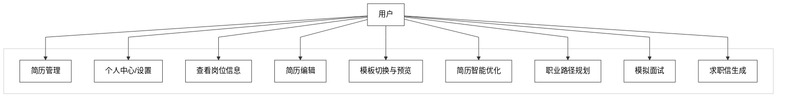

# 图 3.1 - 用户用例图

> 用于论文 **第 3 章 3.2.1 用户用例分析**。将下方 Mermaid 代码复制到 [mermaid.live](https://mermaid.live) 可导出 PNG/SVG 插入论文。

---

## 图 3.1 用户用例图

**对应小节**：3.2.1 用户用例分析  
**图注建议**：求职用户围绕简历管理、简历编辑、智能优化、职业规划、模拟面试和求职信生成完成全流程求职准备，系统形成一站式闭环服务。

---

## 使用说明

1. 打开 [Mermaid Live Editor](https://mermaid.live)。
2. 复制上方代码块（从 `%%{init` 到最后一个 `style` 行）。
3. 粘贴后右侧生成图示；连线为 **折线/直线段**（`curve: linear`），画布与节点为 **白底**（`themeVariables.background` 等）。
4. 导出 PNG 时若背景仍非纯白，可在 Mermaid Live 的 **Actions** 中查看导出选项，或用 SVG 后在矢量软件中统一设背景为 `#ffffff`。
5. 若本地 Mermaid 版本较旧不支持 `U --> A & B & ...` 多线写法，可改为九行：`U --> A`、`U --> B` … `U --> K`。
6. 插入论文并标注图号为「图 3.1 用户用例图」。
