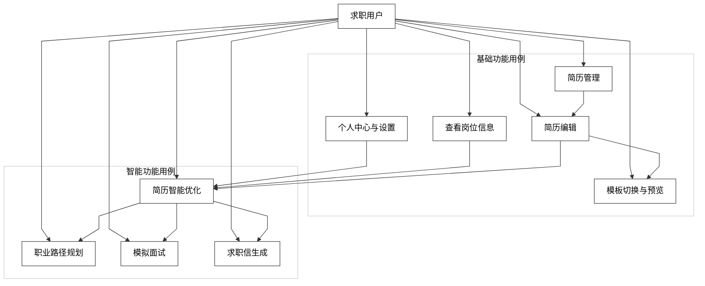

# 图 3.2 - 系统功能用例图

> 用于论文 **第 3 章 3.2.2 系统功能用例图说明**。将下方 Mermaid 代码复制到 [mermaid.live](https://mermaid.live) 可导出 PNG/SVG 插入论文。

---

## 图 3.2 系统功能用例图

**对应小节**：3.2.2 系统功能用例图说明  
**图注建议**：系统围绕求职用户构建基础能力与智能能力两类用例，形成“简历管理-编辑-优化-求职准备”闭环流程。

---

## 使用说明

1. 打开 [Mermaid Live Editor](https://mermaid.live)。
2. 复制上方代码块（从 `%%{init` 到 `style AI` 行）。
3. 连线为折线/直线段（`curve: linear`），画布与子图为白底；导出 PNG 若背景非纯白，可用 SVG 后在软件中铺 `#ffffff`。
4. 若旧版 Mermaid 不支持 `U --> A & B & ...`，可拆成多行 `U --> A`、`U --> B` …
5. 点击 **Actions → PNG** 或 **SVG** 导出图片。
6. 插入论文并标注图号为「图 3.2 系统功能用例图」。
