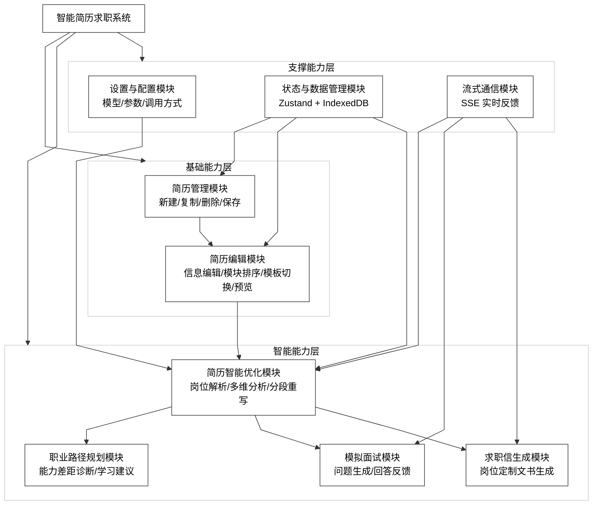

# 图 4.1 - 系统功能模块图

> 用于论文 **第 4 章 4.1 功能模块设计**。将下方 Mermaid 代码复制到 [mermaid.live](https://mermaid.live) 可导出 PNG/SVG 插入论文。

---

## 图 4.1 系统功能模块图

**对应小节**：4.1 功能模块设计  
**图注建议**：系统采用“基础能力层 + 智能能力层 + 支撑能力层”三层模块结构，围绕简历编辑与岗位导向优化形成一站式求职辅助闭环。

---

## 使用说明

1. 打开 [Mermaid Live Editor](https://mermaid.live)。
2. 复制上方代码块（从 `%%{init` 到 `style L3` 行）。
3. 连线为折线/直线段（`curve: linear`），画布与子图为白底；导出 PNG 若背景非纯白，可用 SVG 后铺 `#ffffff`。
4. 若旧版 Mermaid 不支持 `SYS --> L1 & L2 & L3`，可拆成三行分别连接。
5. 点击 **Actions → PNG** 或 **SVG** 导出图片。
6. 插入论文并标注图号为「图 4.1 系统功能模块图」。
