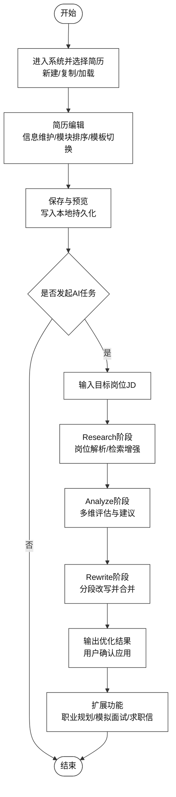

# 图 4.2 - 系统功能流程图

> 用于论文 **第 4 章 4.2 系统功能流程设计**。将下方 Mermaid 代码复制到 [mermaid.live](https://mermaid.live) 可导出 PNG/SVG 插入论文。

---

## 图 4.2 系统功能流程图

**对应小节**：4.2 系统功能流程设计  
**图注建议**：系统围绕“基础编辑流程 + AI增强流程”构建闭环：先完成简历结构化编辑，再执行研究、分析、重写三阶段智能优化，并扩展至职业规划、模拟面试和求职信生成。

---

## 使用说明

1. 打开 [Mermaid Live Editor](https://mermaid.live)。
2. 复制上方代码块（从 `flowchart TB` 到末尾）。
3. 粘贴后右侧生成图示。
4. 点击 **Actions -> PNG** 或 **SVG** 导出图片。
5. 插入论文并标注图号为「图 4.2 系统功能流程图」。
