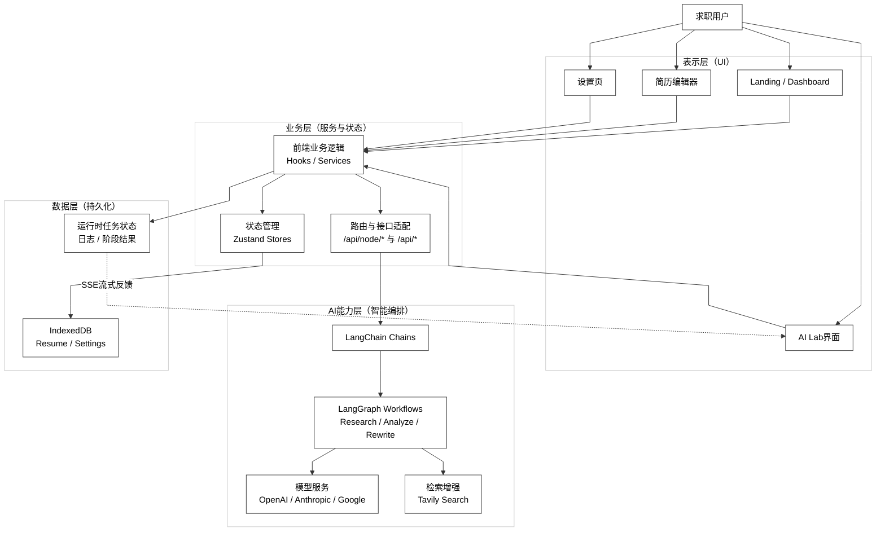

# 图 4.3 - 系统架构图

> 用于论文 **第 4 章 4.3 系统架构设计**。将下方 Mermaid 代码复制到 [mermaid.live](https://mermaid.live) 可导出 PNG/SVG 插入论文。

---

## 图 4.3 系统架构图

**对应小节**：4.3 系统架构设计  
**图注建议**：系统采用分层架构设计，由表示层、业务层、AI能力层和数据层构成；前后端支持本地图执行与代理后端双路径，并通过SSE实现AI任务实时反馈。

---

## 使用说明

1. 打开 [Mermaid Live Editor](https://mermaid.live)。
2. 复制上方代码块（从 `%%{init` 到 `style L4` 行）。
3. 连线为折线/直线段（`curve: linear`），画布与子图为白底；虚线 `-.` 表示 SSE 流式反馈；导出 PNG 若背景非纯白，可用 SVG 后铺 `#ffffff`。
4. 若旧版 Mermaid 不支持 `U --> A & B & C & D` 或 `A & B & C & D --> E`，可拆成多行分别连接。
5. 点击 **Actions → PNG** 或 **SVG** 导出图片。
6. 插入论文并标注图号为「图 4.3 系统架构图」。
