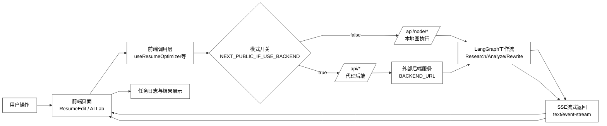

# 图 4.3.2 - 前后端交互架构设计图

> 用于论文 **第 4 章 4.3.2 前后端交互架构设计**。将下方 Mermaid 代码复制到 [mermaid.live](https://mermaid.live) 可导出 PNG/SVG 插入论文。

---

## 图 4.3.2 前后端交互架构设计图

**对应小节**：4.3.2 前后端交互架构设计  
**图注建议**：系统前后端交互采用双路径模式：本地图执行 `/api/node/*` 与代理后端 `/api/*`，并通过 SSE 向前端实时回传任务状态与结果。

---

## 使用说明

1. 打开 [Mermaid Live Editor](https://mermaid.live)。
2. 复制上方代码块（从 `%%{init` 到 `class ... plain` 行）。
3. 连线为折线/直线段（`curve: linear`），画布为白底；导出 PNG 若背景非纯白，可用 SVG 后铺 `#ffffff`。
4. 点击 **Actions → PNG** 或 **SVG** 导出图片。
5. 插入论文并标注图号为「图 4.3.2 前后端交互架构设计图」。
