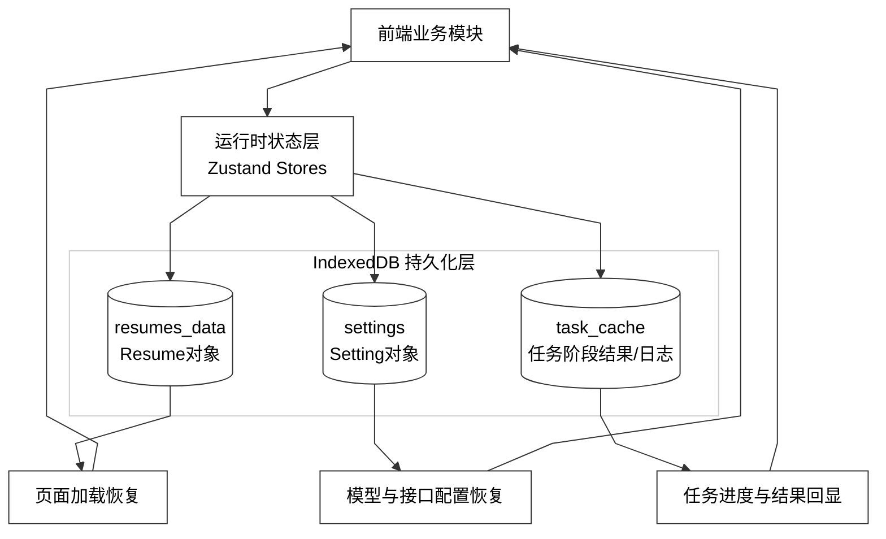

# 图 4.3.3 - 数据存储架构设计图

> 用于论文 **第 4 章 4.3.3 数据存储架构设计**。将下方 Mermaid 代码复制到 [mermaid.live](https://mermaid.live) 可导出 PNG/SVG 插入论文。

---

## 图 4.3.3 数据存储架构设计图

**对应小节**：4.3.3 数据存储架构设计  
**图注建议**：系统采用“运行时状态 + 本地持久化”双层数据机制，核心对象包括 Resume、Setting 与 AI任务状态，实现可恢复与一致性保障。

---

## 使用说明

1. 打开 [Mermaid Live Editor](https://mermaid.live)。
2. 复制上方代码块（从 `%%{init` 到 `style DB` 行）。
3. 连线为折线/直线段（`curve: linear`），画布与子图为白底；导出 PNG 若背景非纯白，可用 SVG 后铺 `#ffffff`。
4. 若旧版 Mermaid 不支持 `STORE --> R & S & T`，可拆成三行分别连接。
5. 点击 **Actions → PNG** 或 **SVG** 导出图片。
6. 插入论文并标注图号为「图 4.3.3 数据存储架构设计图」。
