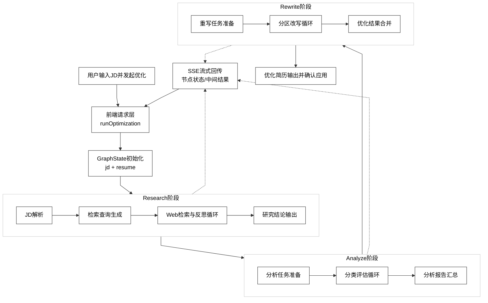

# 图 4.4.2 - 简历智能优化模块详细设计图

> 用于论文 **第 4 章 4.4.2 简历智能优化模块详细设计**。将下方 Mermaid 代码复制到 [mermaid.live](https://mermaid.live) 可导出 PNG/SVG 插入论文。

---

## 图 4.4.2 简历智能优化模块详细设计图

**对应小节**：4.4.2 简历智能优化模块详细设计  
**图注建议**：优化模块采用三阶段工作流（Research、Analyze、Rewrite），通过统一状态对象驱动节点流转，并以SSE向前端持续回传中间结果。

---

## 使用说明

1. 打开 [Mermaid Live Editor](https://mermaid.live)。
2. 复制上方代码块（从 `%%{init` 到 `style G3` 行）。
3. 连线为折线/直线段（`curve: linear`），画布与子图为白底；虚线 `-.` 表示各阶段向 SSE 推送；导出 PNG 若背景非纯白，可用 SVG 后铺 `#ffffff`。
4. 点击 **Actions → PNG** 或 **SVG** 导出图片。
5. 插入论文并标注图号为「图 4.4.2 简历智能优化模块详细设计图」。
