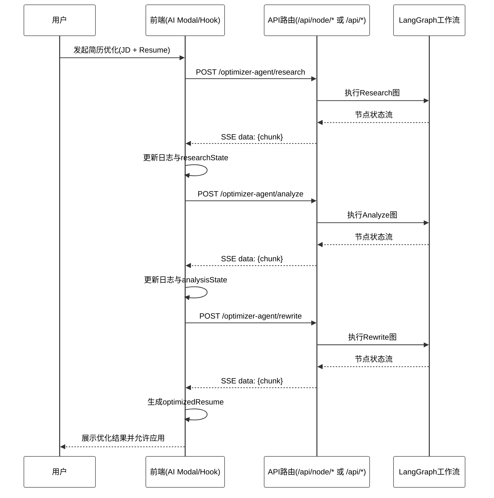

# 图 4.4.3 - 前后端接口与流式通信设计图

> 用于论文 **第 4 章 4.4.3 前后端接口与流式通信设计**。将下方 Mermaid 代码复制到 [mermaid.live](https://mermaid.live) 可导出 PNG/SVG 插入论文。

---

## 图 4.4.3 前后端接口与流式通信设计图

**对应小节**：4.4.3 前后端接口与流式通信设计  
**图注建议**：前端按 research/analyze/rewrite 顺序调用接口，后端以 text/event-stream 返回分阶段状态；前端解析消息后实时更新日志与最终结果。

---

## 使用说明

1. 打开 [Mermaid Live Editor](https://mermaid.live)。
2. 复制上方代码块（从 `%%{init` 到 `FE-->>U` 行）。
3. 本图为 **时序图**（`sequenceDiagram`），生命线与消息线本身为折线/正交走向；`mirrorActors: true` 会在图 **底部** 再次显示各参与者（用户、前端、API、工作流），与顶部对应；`theme` 与 `themeVariables` 用于 **白底** 与配色。
4. 导出 PNG 若背景非纯白，可用 SVG 后铺 `#ffffff`。
5. 点击 **Actions → PNG** 或 **SVG** 导出图片。
6. 插入论文并标注图号为「图 4.4.3 前后端接口与流式通信设计图」。
