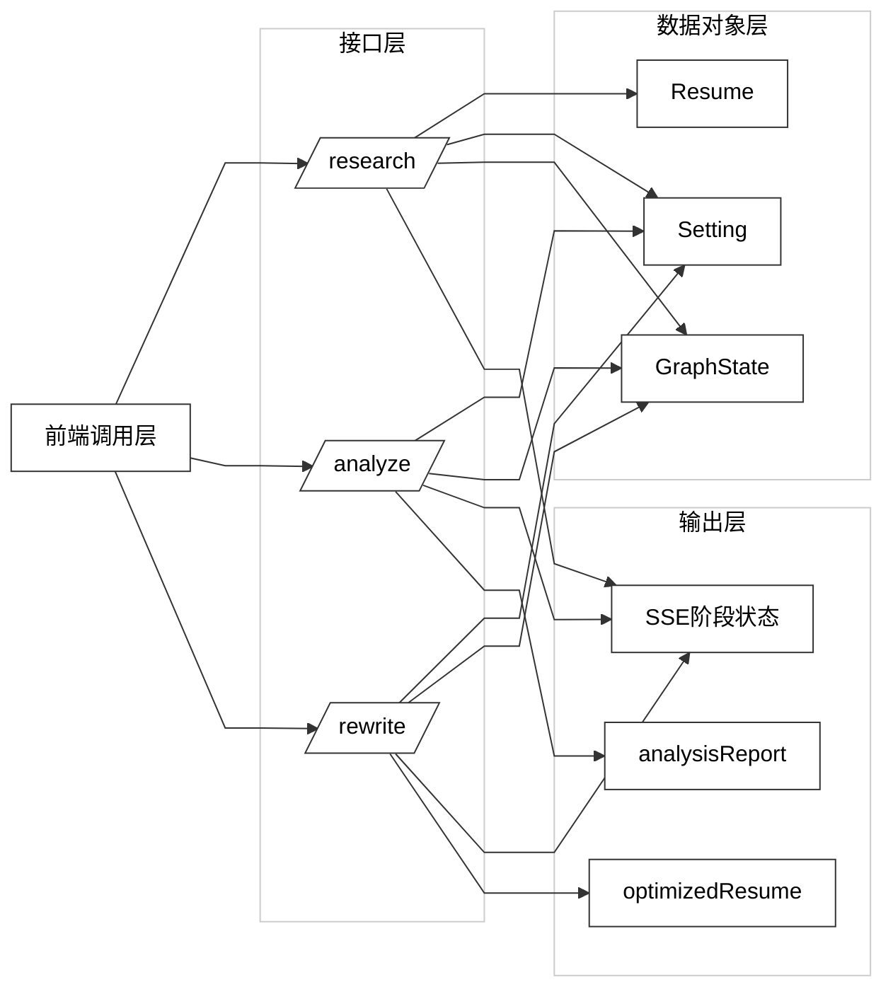

# 图 4.5 - 接口与数据字典关系图

> 用于论文 **第 4 章 4.5 系统接口与数据字典概述**。将下方 Mermaid 代码复制到 [mermaid.live](https://mermaid.live) 可导出 PNG/SVG 插入论文。

---

## 图 4.5 接口与数据字典关系图

**对应小节**：4.5 系统接口与数据字典概述  
**图注建议**：系统接口按 Research、Analyze、Rewrite 三阶段调用，围绕 Resume、Setting、GraphState 三类核心数据对象完成状态流转与结果输出。

---

## 使用说明

1. 打开 [Mermaid Live Editor](https://mermaid.live)。
2. 复制上方代码块（从 `%%{init` 到 `style OUT` 行）。
3. 连线为折线/直线段（`curve: linear`），画布与子图为白底；导出 PNG 若背景非纯白，可用 SVG 后铺 `#ffffff`。
4. 若旧版 Mermaid 不支持 `&` 多线写法，可拆成多行分别连接（与原文等价）。
5. 点击 **Actions → PNG** 或 **SVG** 导出图片。
6. 插入论文并标注图号为「图 4.5 接口与数据字典关系图」。
